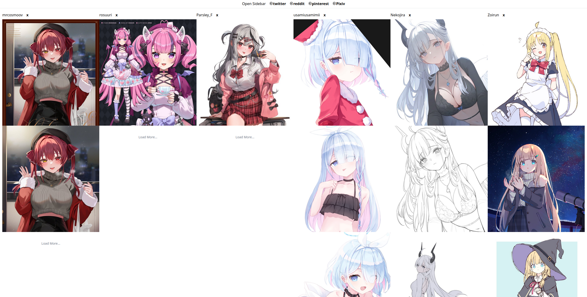

# Social Media Manager

**This website is not deployed anywhere anymore. Because Heroku is not free anymore :(**

This project contains a REST API and eventually a frontend for it. The goal is to manage all your social media platforms
on a single website.

REST API can be found here: https://sns-manager.herokuapp.com/

New UI will be available here: https://sakkaku-web.github.io/social-media-manager/

## Features

### Post on multiple social medias

Currently only works via scripts in `./scripts`.
Log in through the REST API and save tokens in `.env` according to `.env.sample`

Post with python scripts or create a script like `main.sh`

### Reference Board

- Twitter: add users to show their posted images
- Reddit: shows all upvoted posts (removed for now)

## Endpoint Sources

- [x] **Reddit**: https://www.reddit.com/dev/api
- [x] **Twitter**: https://developer.twitter.com/en/docs/twitter-api
- [x] **Pixiv**: there is no official rest api documentation. But it's possible to find it using the pixiv mobile app
      and [mitmproxy](https://mitmproxy.org). The easiest way is using an [android emulator](https://genymotion.com/) (< Android 7.0)
- [ ] **Pinterest**: https://developers.pinterest.com/docs/api/v5/
- [ ] **Imgur**: should be possible, but no personal need right now.
- [ ] **Artstation**: they have an API but it seems to be more protected than pixiv. Finding the endpoints is not enough
- [ ] **Facebook**: Just no, they just want our data for everything
- [ ] **Instagram**: Need to go through facebook...

## Development

Backend

- Create `.env` file using `.env.sample` and set the values
- Install packages: `pip install -r requirements.txt`
- Start backend: `flask run`

Frontend: inside `./sns-manager`

- Install dependencies: `npm i`
- Start fronend: `npm run dev`
